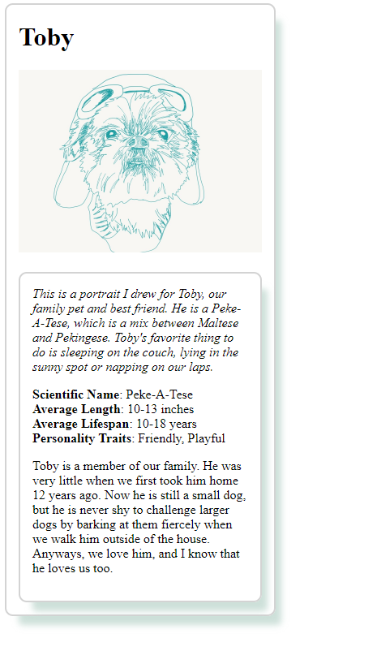

# Grow with Google Challenge Scholarship

**Grow with Google Challenge Scholarship** to the **Front-End Developer track** is a 3-month challenge course, which I was able to complete in 2 weeks. Hooray!

## Projects Overview:

#### Project 3: Pixel Art Maker
- Build a single-page web app that allows users to draw pixel art on a customizable canvas!

- [Link](https://codepen.io/Momothepikachu/full/vpqoqK)
---

#### Project 2: Animal Trading Cards
- Design and convert a prototype into a functional webpage!

- [Link](https://codepen.io/Momothepikachu/full/mpjMQO)
---

#### Project 1: Mockup to Article
- Converting a mockup of a blog article into a real website!

- [Link](https://codepen.io/Momothepikachu/full/jYKyZB)

